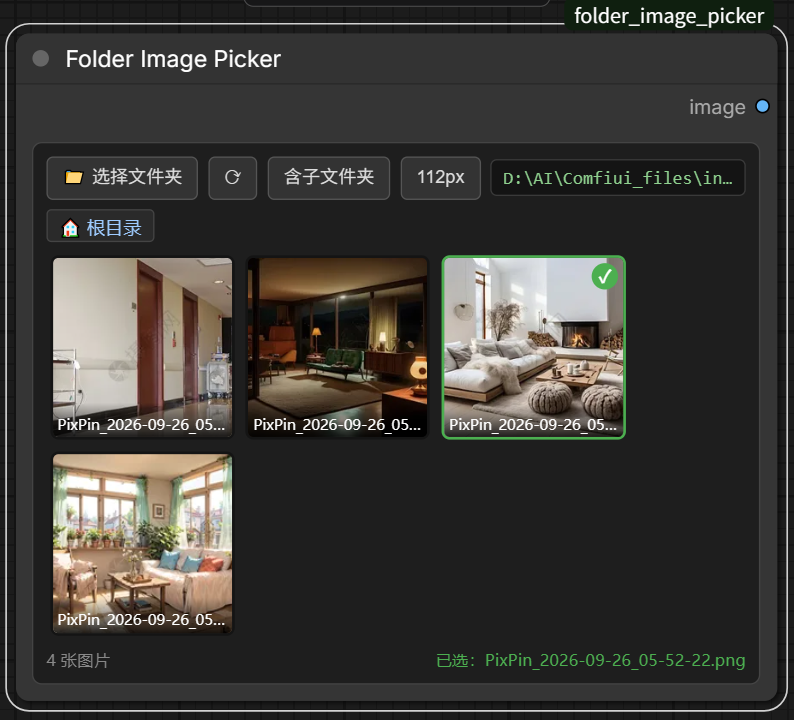

# Folder Image Picker for ComfyUI

A node that browses image folders with an inline thumbnail grid, with an explicit
folder per node and recursive subfolder support.

Built for workflows that pull from several image directories — characters in one
folder, outfits in another — where the built-in upload widget keeps reopening the
last folder you used, and where a fixed source folder per node removes the guessing.



## Why

ComfyUI's built-in image loader always reopens the folder you last picked. If two
loader nodes point at two different folders, switching the second one drops you in
the first one's directory. This node gives every node its own remembered folder, so
the picker opens where you expect.

## Features

- **Per-node folder** — the folder is stored in the workflow, so each node keeps its own location
- **Inline thumbnail grid** — click a thumbnail to select; no dialog round-trip
- **Recursive subfolders** — optional toggle that also lists images in nested subdirectories
- **Breadcrumb navigation** — walk into subfolders and back out
- **Native folder dialog** — modern Windows folder picker (opened at the node's current folder)
- **Fixed-size cells** — thumbnails stay square when the node is resized; cycle 88 / 112 / 144 / 192 px
- **Thumbnail cache** — 320 px WebP thumbnails, keyed by path and mtime, so edits invalidate automatically

## Installation

Clone into your `ComfyUI/custom_nodes` directory:

```bash
cd ComfyUI/custom_nodes
git clone https://github.com/Martlet-Tech/Folder-Image-Picker
```

Restart ComfyUI. No extra Python dependencies are required.

For the portable Windows build the path is:

```bash
cd ComfyUI_windows_portable/ComfyUI/custom_nodes
git clone https://github.com/Martlet-Tech/Folder-Image-Picker
```

## Usage

Add the **Folder Image Picker** node (category `image`).

1. Click **📁 Choose Folder** to choose a directory, or type a path into the path box.
2. Click **Subfolders** to include nested subfolders. In recursive mode the image key
   becomes `subfolder/filename`, keeping duplicates distinguishable.
3. Click a thumbnail to select it; click it again to clear the selection.
4. Use the breadcrumb or the folder chips to navigate; **⟳** re-reads the directory.
5. The size button cycles thumbnail size (88 / 112 / 144 / 192 px).

The selected image is exposed as an `IMAGE` output.

## Notes

- Non-Windows systems fall back to a manual path entry; the grid and scanning work everywhere.
- The folder dialog uses PowerShell with `IFileOpenDialog`. If `powershell.exe` is
  unavailable the picker returns an empty path instead of failing.
- Requests are confined to the configured folder. Traversal attempts (`../`) are rejected
  with HTTP 403, and paths are re-validated at load time.

## License

MIT — see [LICENSE](LICENSE).
